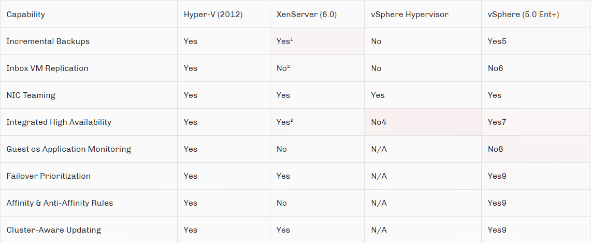

# Task 2.1
## Part 1
**1. What are the most popular hypervisors for infrastructure virtualization?**

***1. Native Hypervisors.
They runs directly on the host's hardware to control the hardware and to manage guest operating 
** VMware ESX
** Microsoft Hyper-V
** Citrix XenServer
** Oracle VM Server for SPARC
** Oracle VM Server for x86
** Nutanix AHV

***2. Hosted Hypervisors.
They runs on a conventional operating system (OS) just as other computer programs do. A guest operating system runs as a process on the host.
** VMware Workstation
** VirtualBox 
** Microsoft Virtual PC
** QEMU 
** Parallels Desktop for Mac

### **Features of popular Hypervisors**
** 2. Briefly describe the main differences of the most popular hypervisors.

Scalability,Performance;Density

* 

High Availability & Resiliency

* 

## Part 2

### **Work with VirtualBox**

1. VirtualBox version
* 

2. Create VM1 - VM1_TARYRAIEV
* 

3. Install Ubuntu 20.04

4. Make Clone VM1 - VM1_TARYRAIEV
* 

5. Make Group
* 

6. Make snapshots of VM1 - VM1_TARYRAIEV
* 

7. Export VM1_TARYRAIEV to .ova file.
* 

### **Virtual machines configuration**

1. Configure Shared folder beetween VMhost and VM1_TARYRAIEV.
* 
* 

2. Configure connect from host USB port to guest USB port.
* 
* 
* 

3. Configure different network modes for VM1, VM2.
Connection Table

<table>
	<tr>	
		<td>Mode</td><td>VM -> Host</td><td>VM <- Host</td><td>VM1 <-> VM2</td><td>VM -> Net/LAN</td><td>VM -> Net/LAN</td>
	</tr>
	<tr>
		<td>Host-only</td><td>+</td><td>+</td><td>+</td><td>-</td><td>-</td>
	</tr>
	<tr>
		<td>Internal</td><td>-</td><td>-</td><td>+</td><td>-</td><td>-</td>
	</tr>
	<tr>
		<td>Bridged</td><td>+</td><td>+</td><td>+</td><td>+</td><td>+</td>
	</tr>
	<tr>
		<td>NAT</td><td>+</td><td><a href="https://www.virtualbox.org/manual/UserManual.html#natforward">Port forward</a></td><td>-</td><td>+</td><td><a href="https://www.virtualbox.org/manual/UserManual.html#natforward">Port forward</a></td>
	</tr>
	<tr>
		<td>NATservice</td><td>+</td><td><a href="https://www.virtualbox.org/manual/UserManual.html#network_nat_service">Port forward</a></td><td>+</td><td>+</td><td><a href="https://www.virtualbox.org/manual/UserManual.html#network_nat_service">Port forward</a></td>
	</tr>
</table>  

4. Configure different network modes for VM1_TARYRAIEV, VM2_TARYRAIEV.

### **Table of mode connections**
* 

### **NAT mode.**
* 
* 

### **Bridged mode**
* 
* 

### **Internal network**
* 
* 
* 

### **Host-only adapter**
* 
* 

-----------

## **VBoxManage**

1. list vms and showvminfo command
* 

3. creatvm command
* 

4. start VM , reset VM, stop VM, take snapshot of VM, clone VM and rename VM 
* 

-----------

## Part 3

### **Vagrant**

1. Create folders , Initialized the environment with the default Vagrant box, Start vagrant vm.
* 

4. Connect to vm by ssh (MobaXterm)
* 

5. Check Date
* 

6. Stop and delete VM
* 

7. Create own vagrant box
* 

-----------