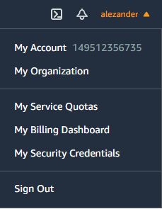
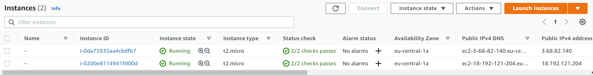

# Task 2.2

## Module 2 Virtualization and Cloud Basic

## **Lightsail Instance**

1. Register in AWS 

* 

2. Create Instance and make new SSH key for VM

* 

* 

* 

3. Connect to VM by aws web cli 

* 

## **EC2 Instance**
 
1. Create Instance and SSH key for VM

* 

* 

2. Connect to VM by ssh (mobaxterm)

* 

* 

* 

## **Create ec2 instance snapshot**

1. Create instance snapshot

* 

* 

## **Instance volumes**

1. Create and attach volume Disk_D

* 

* 

2. Format and mount a Disk_D. Create file file.txt

* 

## **Create instance from backup - snapshot**

1. Create image from instance snapshot

* 

* 

* 

* 

2. Detach/Attach volume and view file

* 

* 

* 

## **Launch and configure WordPress instance with Amazon Lightsail**

1. Create WP instance in Lightsail

* 

* 

## **Create Bucket and add IAM role**

1. Create Bucket and add IAM role

* 

* 

* 

* 

* 

2. Copy file to S3 bucket install and use aws cli

* 

* 

## **Amazon ECS**

1. Create cluster and run demo app in ECS.

* 

* 

* 

* 

* 

* 

* 

## **Static website Amazon on S3**

* Working process
  Github commit -> GH actions -> copy files to s3 bucket

* 

* 

* 

* 

* 

* 

* 

* 

* s3 site : http://s3taryraiev.s3-website.eu-central-1.amazonaws.com/

* Github repo with site:  https://github.com/alezander86/s3-static

----------------
