## Module 2 NetworkingFundamentals

# Task 3.1 Create Enterprise, Data Center, Home Office and add ip adresses for them (I was born 13.04.1986)

1. Create Enterprise

* 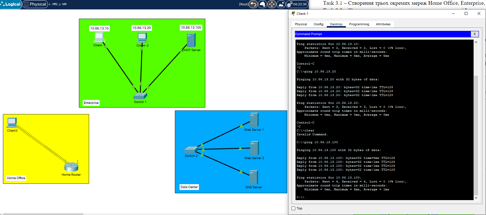

2. Data Center

* 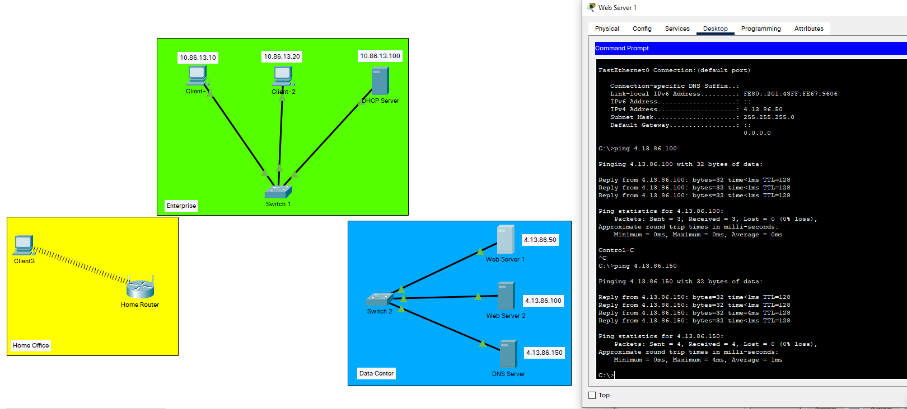

3. Home Office

* 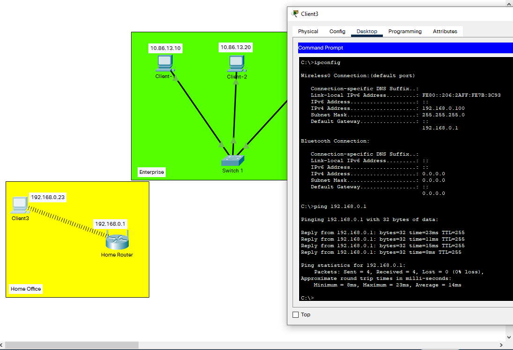

## Work with Wireshark

* 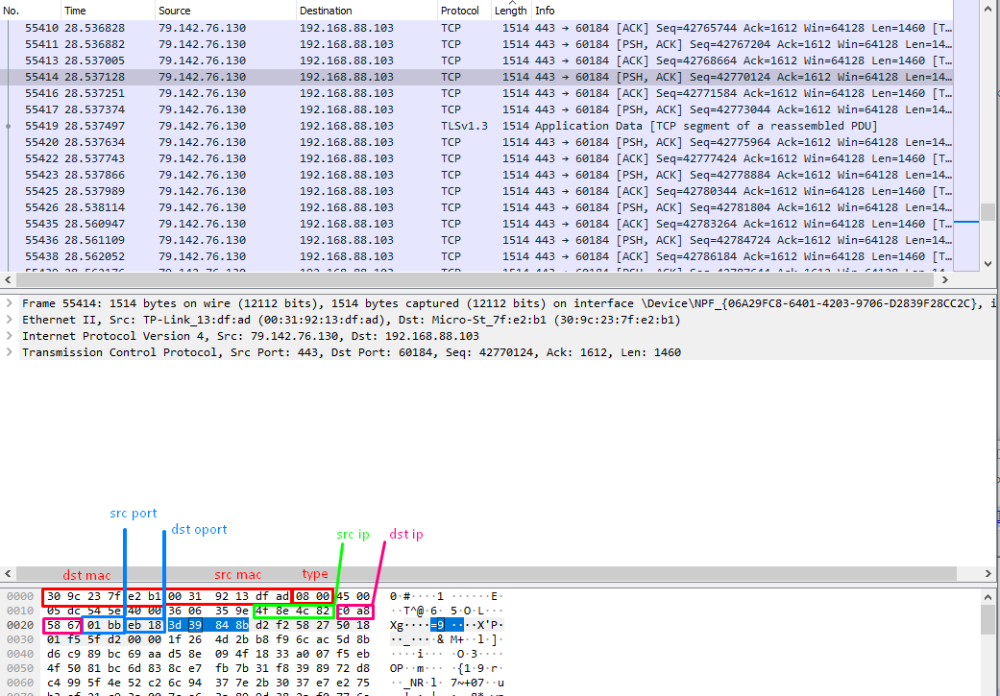

*Source MAC Address: 00:31:92:13:df:ad   
*Destination MAC Address: 30:9c:23:7f:e2:b1  
*Source IP Address: 79.142.76.130  
*Destination IP Address: 192.168.88.103  
*Source TCP Port : 443  
*Destination TCP port: 60184  

# Task 3.2 Vlan and connection of different networks

5 and 6 Check ping to the DefaultGateways

* 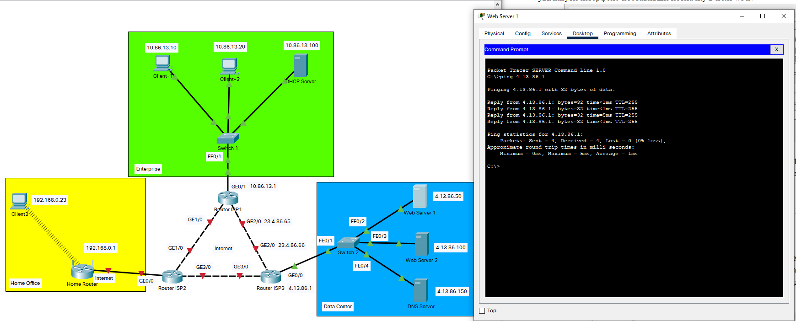

* 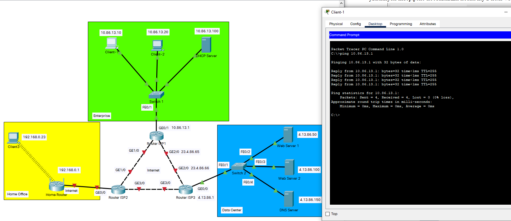

* 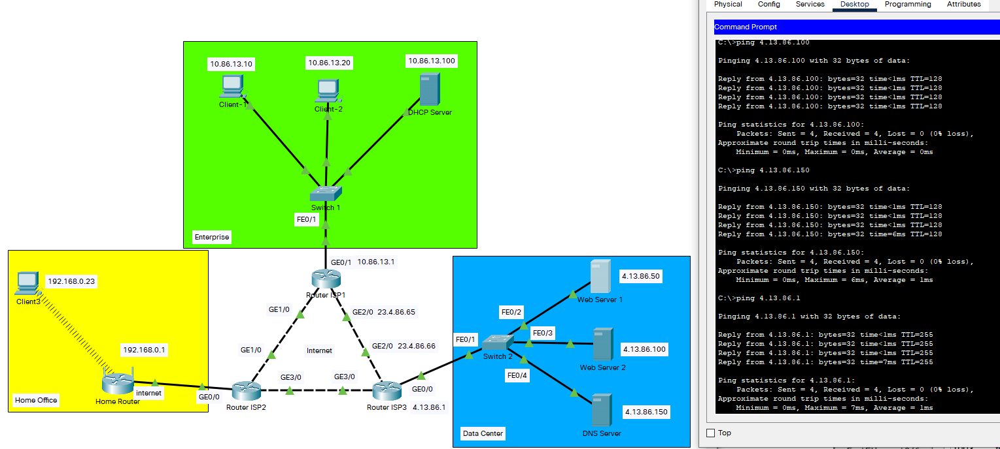

7. Change mask to the 255.255.255.192 and check ping.

* 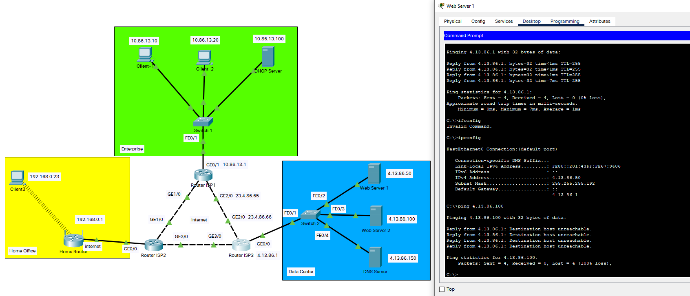

* 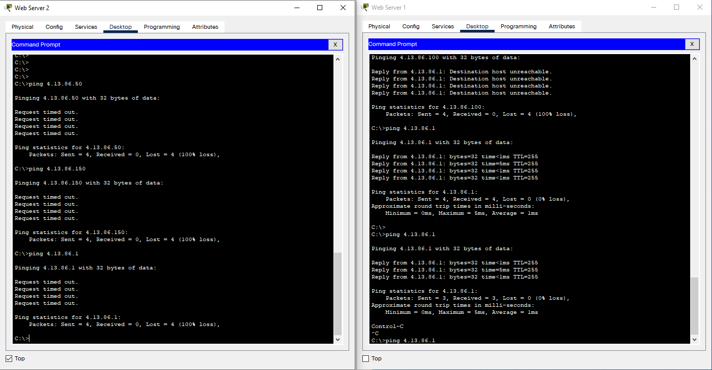

8. There is a ping only between web server 1 and the gateway, since they are in the same subnet range.

* 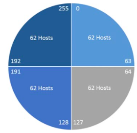

10. There will be no ping due to the lack of routes between Vlans on the switch

* 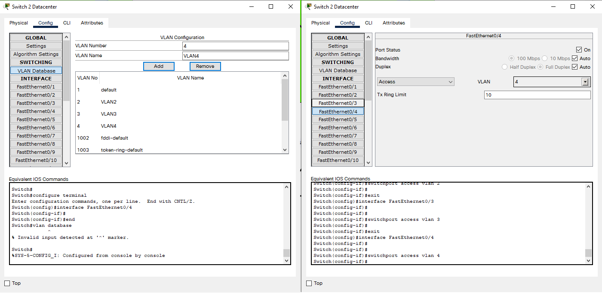

12. Configuring inter-Vlan routing

* 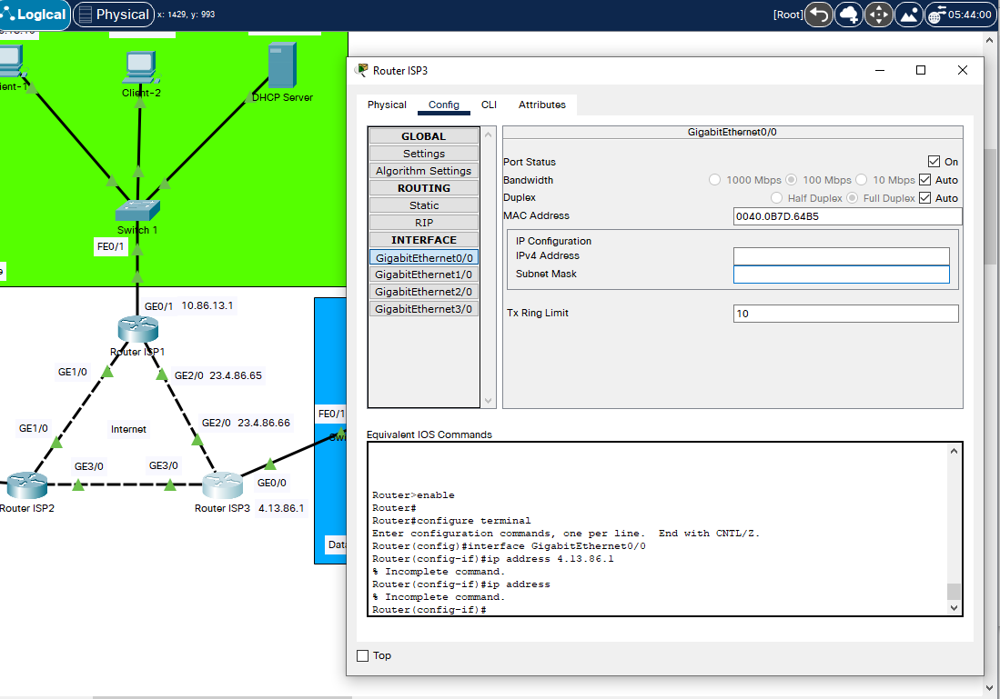

* 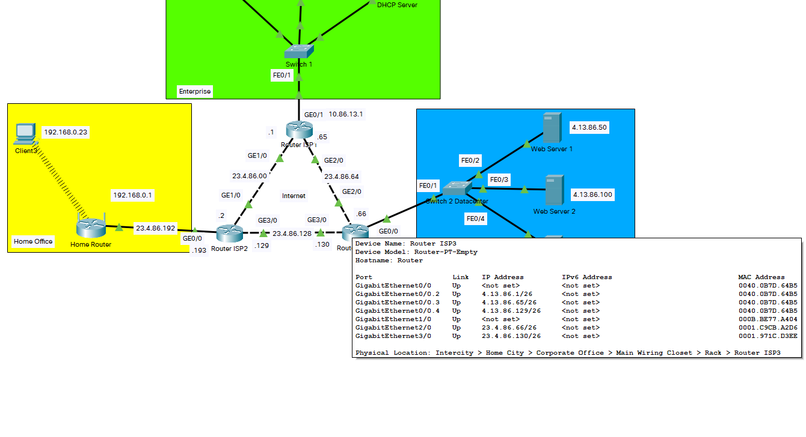

Router#conf t
Enter configuration commands, one per line.  End with CNTL/Z. 
Router(config-if)#interface GigabitEthernet0/0.2 
Router(config-subif)#encapsulation dot1Q 2 
Router(config-subif)#eneip address 4.13.86.1 255.255.255.192 
Router(config-subif)#interface GigabitEthernet0/0.3 
Router(config-subif)# 
%LINK-5-CHANGED: Interface GigabitEthernet0/0.3, changed state to up 

%LINEPROTO-5-UPDOWN: Line protocol on Interface GigabitEthernet0/0.3, changed state to up 
interface GigabitEthernet0/0.3 
Router(config-subif)#interface GigabitEthernet0/0.3 
Router(config-subif)#encapsuip address 4.13.86.1 255.255.255.192ip address 4.13.86.65 255.255interface GigabitEthernet0/0.3interface  GigabitEthernet0/0.4 
Router(config-subif)# 
%LINK-5-CHANGED: Interface GigabitEthernet0/0.4, changed state to up 

%LINEPROTO-5-UPDOWN: Line protocol on Interface GigabitEthernet0/0.4, changip address 4.13.encapsulation dot1Q 3encapsip address 4.13.86.65  255.255.255.192ip address 4.13.86.129 255.255.255.192 
Router(config-subif)#eiexit 
Router(config)#txtexit 

15. Change Gateways

* 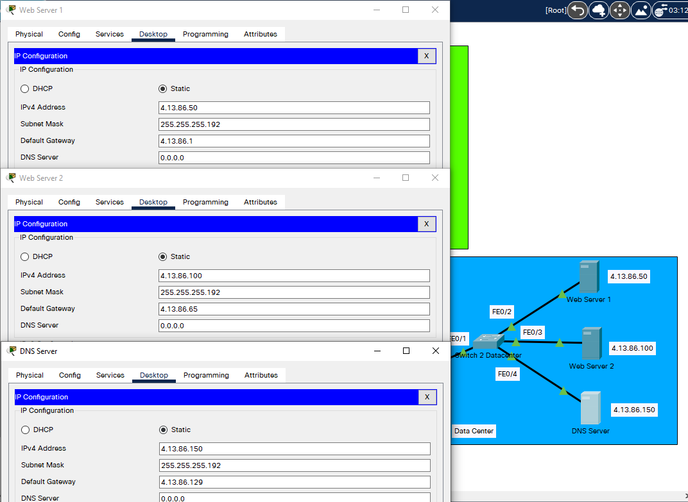

16. Testing connection by ping

* 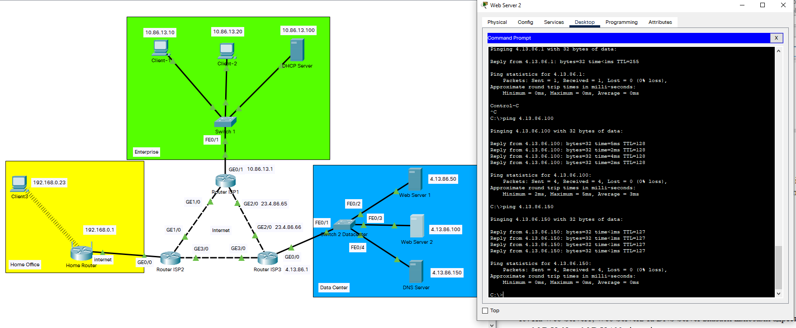

# Task 3.3 Routing settings
 
1. In Task 3.2.2 my internet connection is 23.4.86.00/26

* 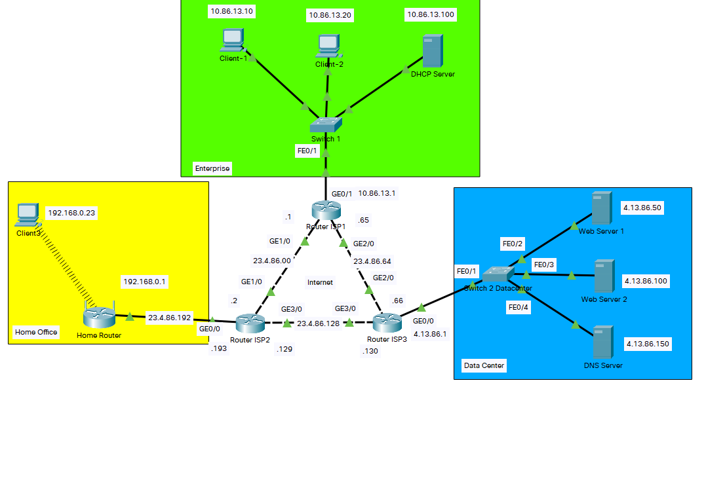

* 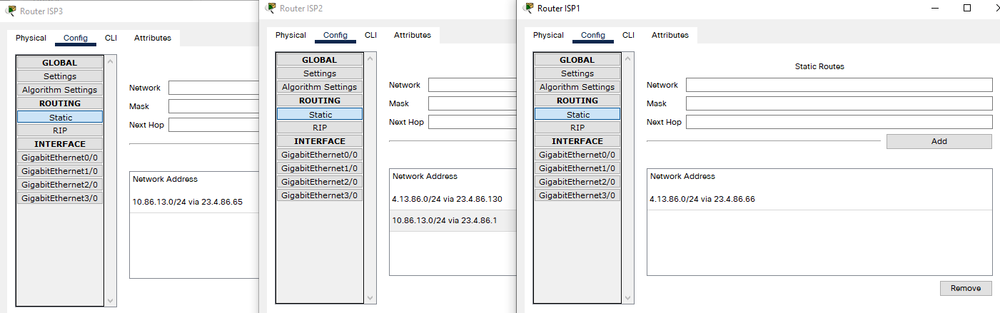

2. Configure routing on the HomeRouter 

* 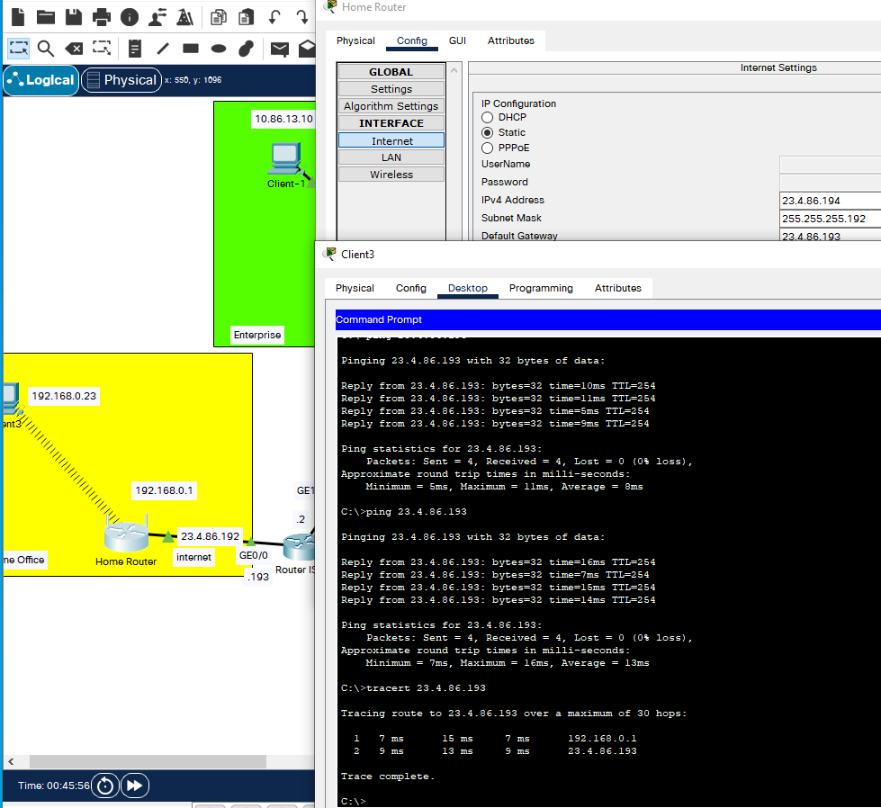

3. Check network performance using the ping and tracert commands between Client1 and WebServer2.

* 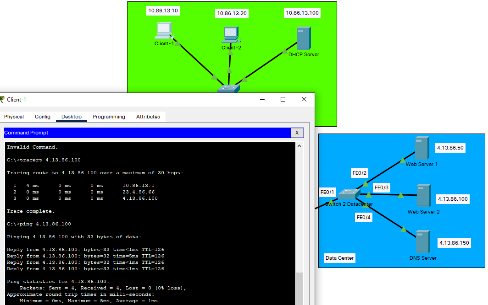

