# Task 4.1

*PART 1*

1 and 2. Install MySQL server on VM, configure it and create user:

sudo apt-get install mysql-server -y -- install

sudo mysql_secure_installation --configure

sudo mysql --login

* 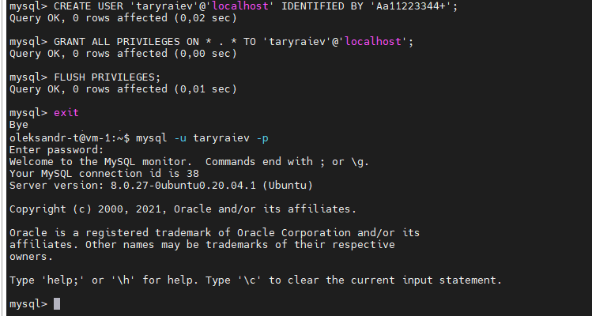

3. Create database on the server:

* 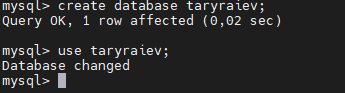

4. Create tables:

create table client (id integer auto_increment Primary Key, lastName varchar(30), firstname varchar(30));

create table goods (id integer auto_increment Primary Key, goods_name varchar(30), goods_article int);

create table sell (id integer auto_increment Primary Key, client_id INT, goods_id INT, price decimal(10.2));

* 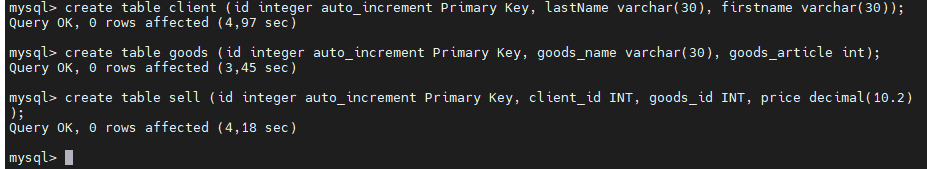

5. Fill in the tables:

insert into client (lastName, firstname) values ('Vazovski', 'Mike'), ('Ptihkin', 'Alexey'), ('Kylikov', 'Ivan');

insert into goods (goods_name, goods_article) values ('iphone 13', '1111'), ('ipad 3', '5453'), ('ipod', '4534'), ('galaxy s7', '1735');

insert into sell (client_id, goods_id, price) values ('1', '1', '10000'), ('2', '1', '10000'), ('2', '1', '6500'), ('1', '3', '3700'), ('3', '4', '4000'), ('1', '4', '4000');

6. Construct and execute SELECT operator with WHERE, GROUP BY and ORDER BY:

* 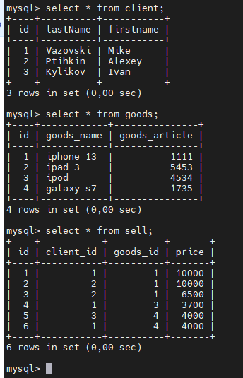

* 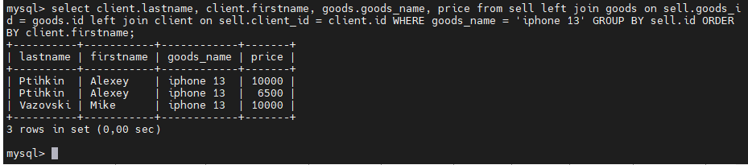

7. Execute other different SQL queries DDL, DML, DCL.

7.1 DDL create, alter, drop, truncate:

create table Iteams (id integer auto_increment Primary Key, Name varchar(30), Number varchar(30)); -- create table

* 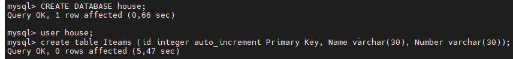

alter tables Iteams ADD price INT NOT NULL; -- add column to table;

* 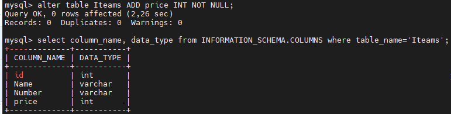

truncate table iteams; -- delete all record from table;

* 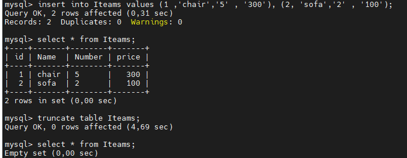

Drop table iteams; -- delete table;

* 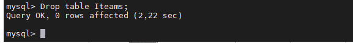

7.2 DML insert, update, delete: 

insert into Iteams values (1 ,'chair','5'), (2, 'sofa','2'); -- used to insert data into a table.

* 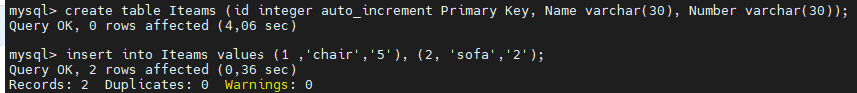

update Iteams SET Name = 'bed' where id = 2; -- update existing data within a table.

* 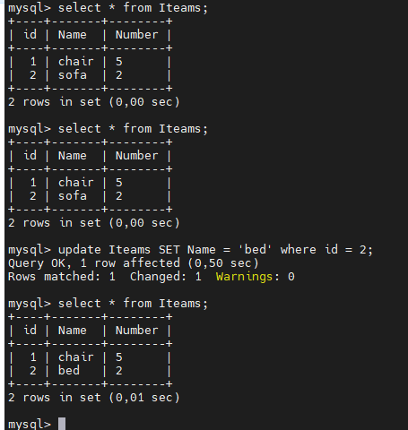

delete from Iteams where = id '1'; -- delete records from a database table.

* 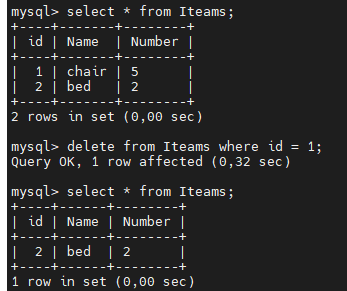

7.3 DCL GRANT, REVOKE, DENY:

create user 'taryraiev2'@'%' identified with mysql_native_password by 'Aa11223344+'; -- create user

grant create, alter on *.* to 'taryraiev2'@'%' with grant option; -- add rule create and alter

8. Create a database of new users with different privileges. Connect to the database :

create user 'taryraiev3'@'%' identified with mysql_native_password by 'Aa11223344+'; -- create user

grant drop, delete on *.* to 'taryraiev3'@'%' with grant option;  -- add rule drop and delete

create user 'taryraiev4'@'%' identified with mysql_native_password by 'Aa11223344+'; -- create user

grant select on *.* to 'taryraiev4'@'%' with grant option;  -- add rule select

create user 'taryraiev5'@'%' identified with mysql_native_password by 'Aa11223344+'; -- create user

grant insert, update on *.* to 'taryraiev5'@'%' with grant option;  -- add rule insert, update

flush privileges;

* 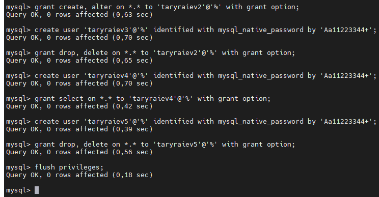

8.1 Verify that the privileges allow or deny certain actions:

* 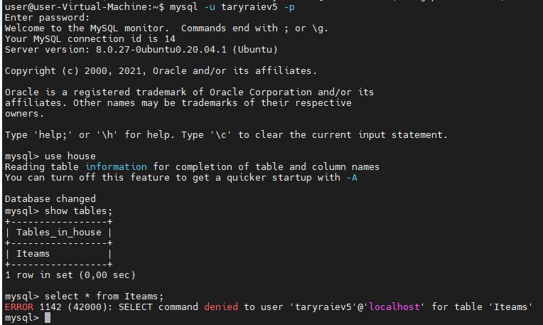

9. Make a selection from the main table DB MySQL:

* 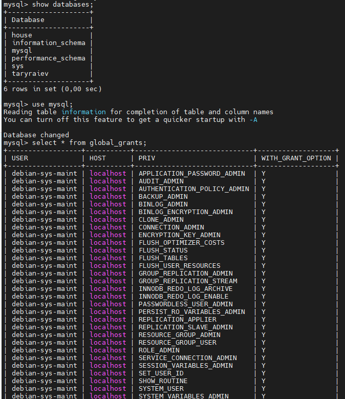

* 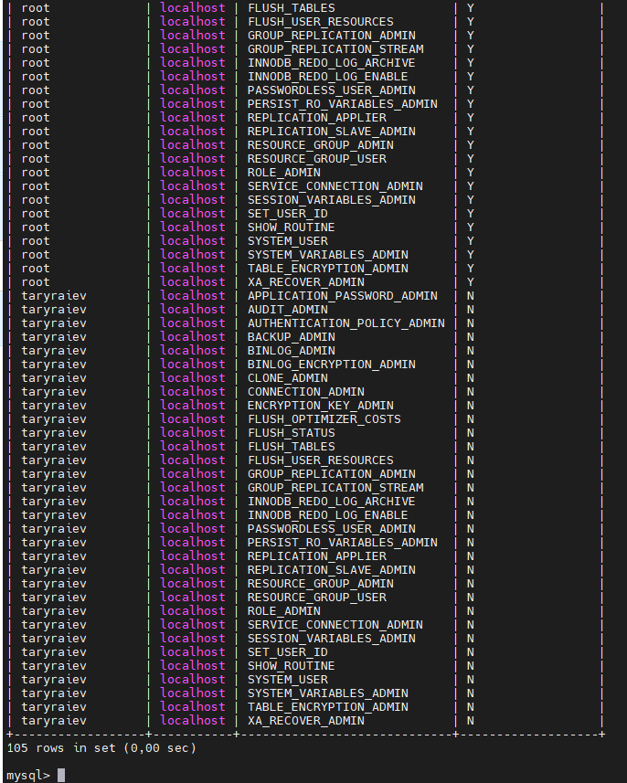

*PART 2*

10. Make backup of your database:

* 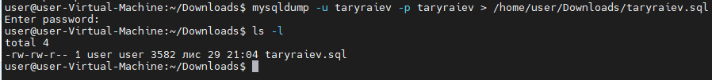

11. Delete the table and/or part of the data in the table.

* 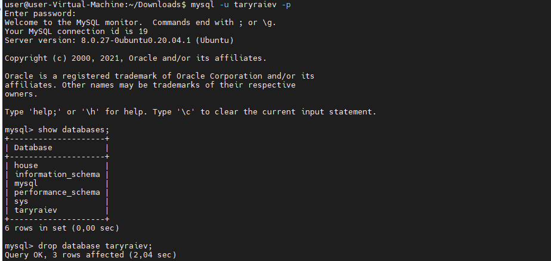

* 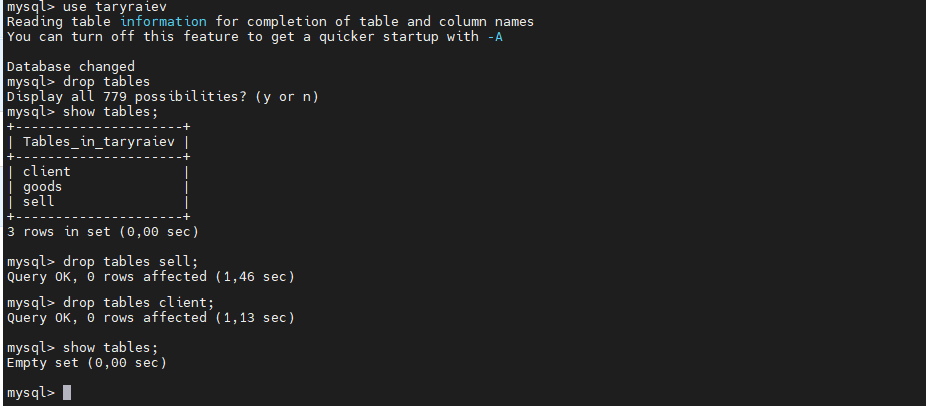

12. Restore your database:

* 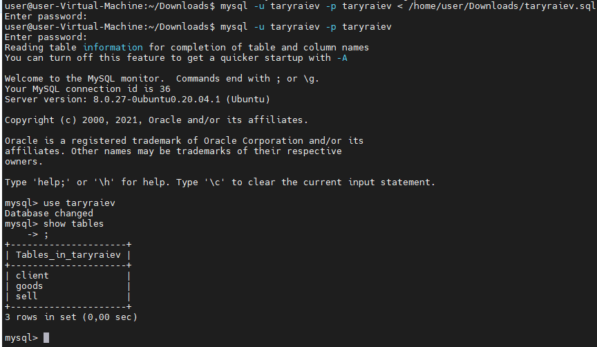

13. Transfer your local database to RDS AWS:

* 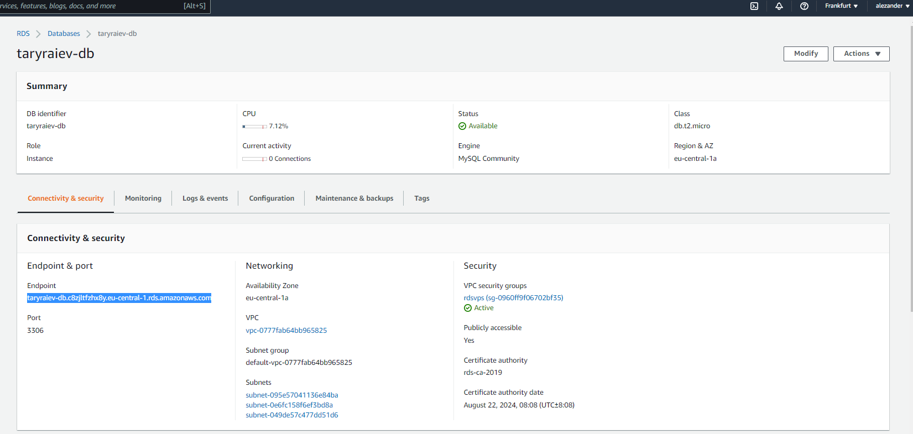

* 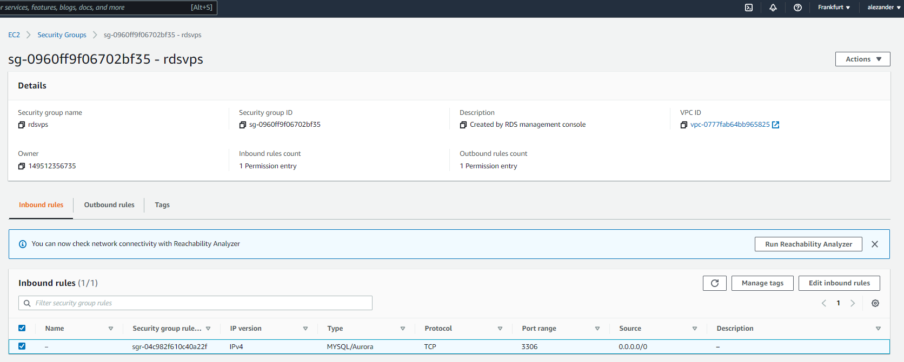

14. Connect to your database:

* 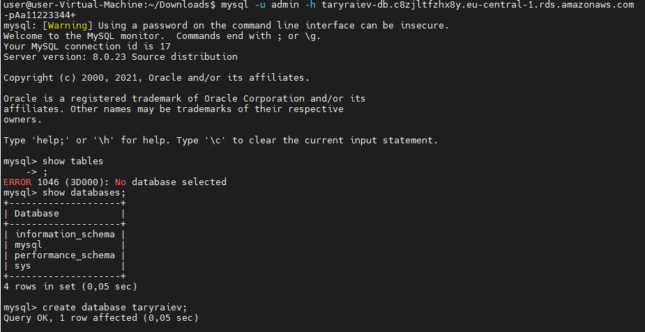

15. Execute SELECT operator similar step 6:

* 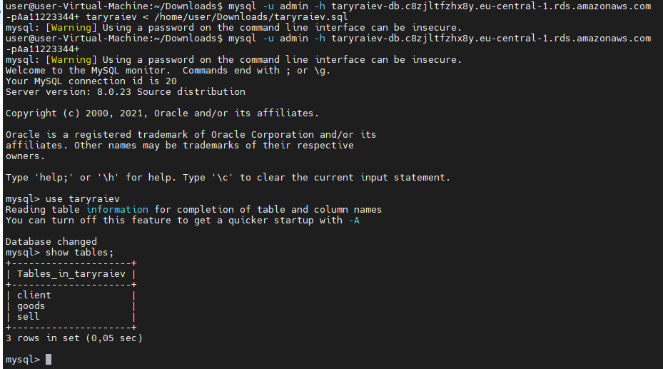

* 

16. Create the dump of your database:

* 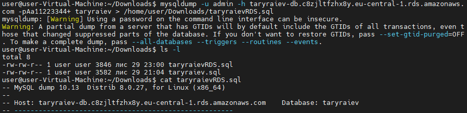

*PART 3*

17.Create an Amazon DynamoDB table:

* 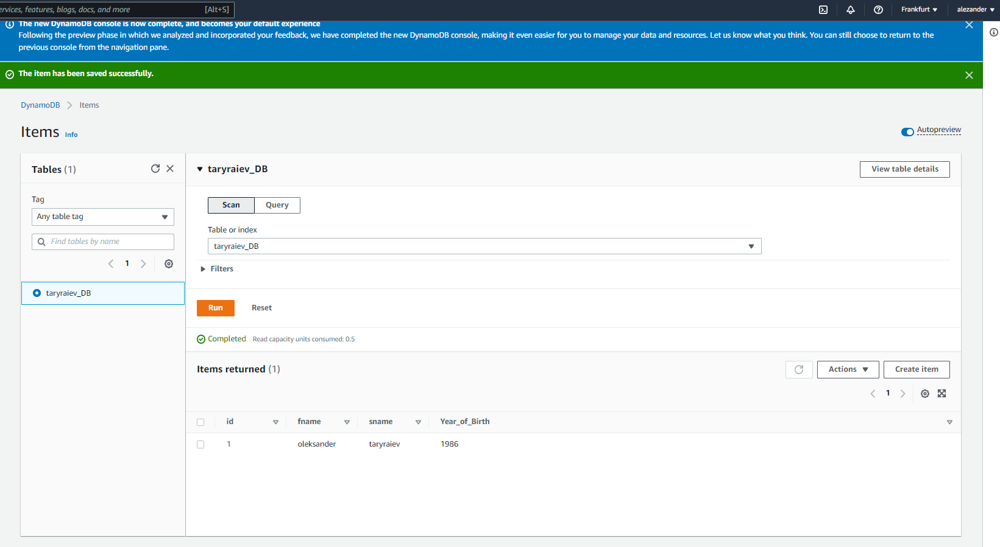

18.Enter data into an Amazon DynamoDB table:

* 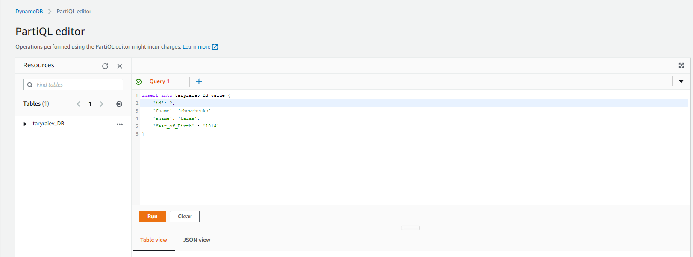

* 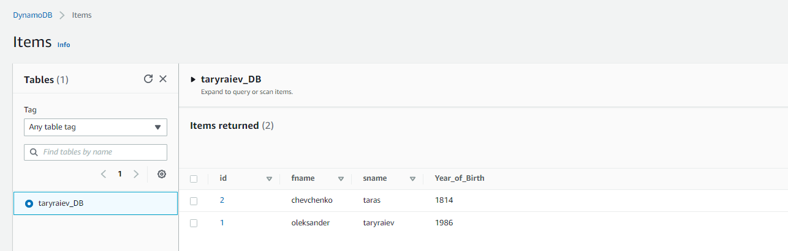

19.Query an Amazon DynamoDB table using Query and Scan:

* 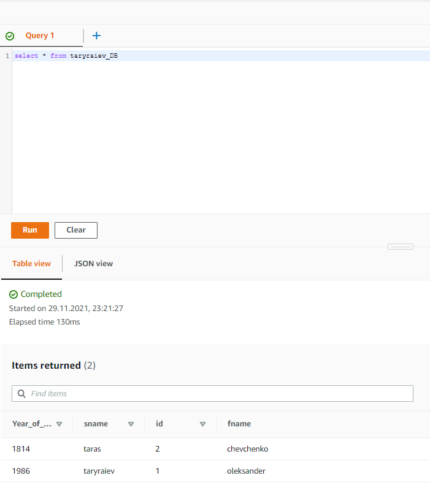