# Task 5.2

1. Analyze the structure of the /etc/passwd and /etc/group file, what fields are present in it, what users exist on the system? Specify several pseudo-users, how to define them?

/etc/group containes from 'group_name', 'password' and 'group_id'.

* 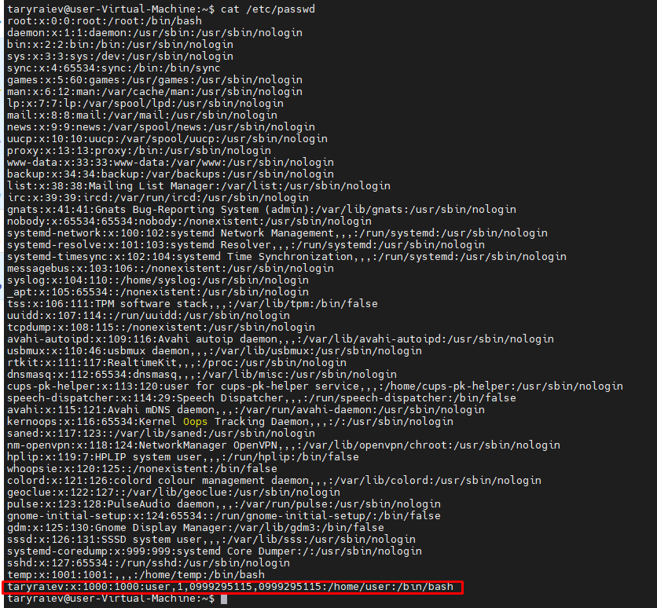

* 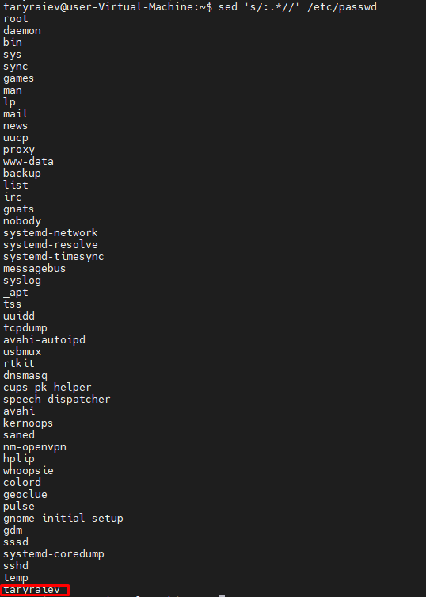

Users on screenshots red is 'root', 'taryraiev'. Pseudo-users is like 'daemon', 'bin', 'nobody' and others is green.

* 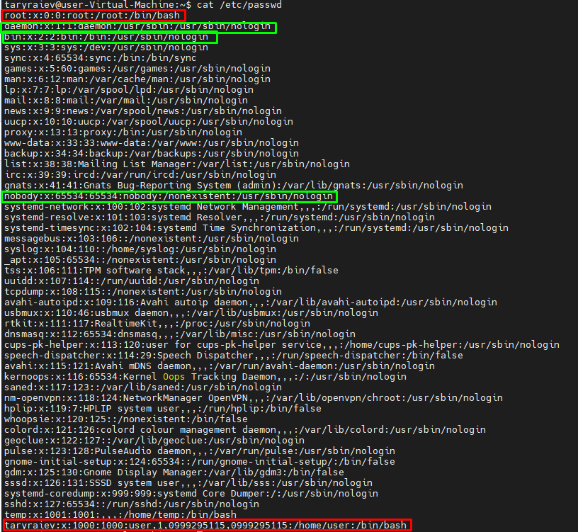

2. What are the uid ranges? What is UID? How to define it?

UID from 1 to 999 this is system processes, daemons, pseudo-users etc. And from 1000+ it's regular users in system.

3. What is GID? How to define it?

It's unique Group ID number in system. You can define both in /etc/passwd and /etc/group.

* 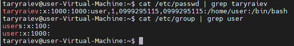

4. How to determine belonging of user to the specific group? 

Information about group we can define it in /etc/passwd

* 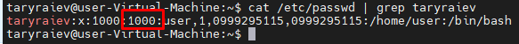

5. What are the commands for adding a user to the system? What are the basic parameters required to create a user?

Create a user it's 'useradd -m user' after change password 'passwd user'

Add to some groups if need 'usermod -aG Group user'

* 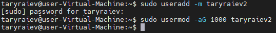

6. How do I change the name (account name) of an existing user?

Change it by command 'usermod -l new_user_name old_user_name'

* 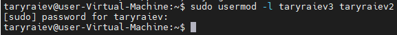

7. What is skell_dir? What is its structure?

Skeleton dir it's, a template for initiate home directory for new user

* 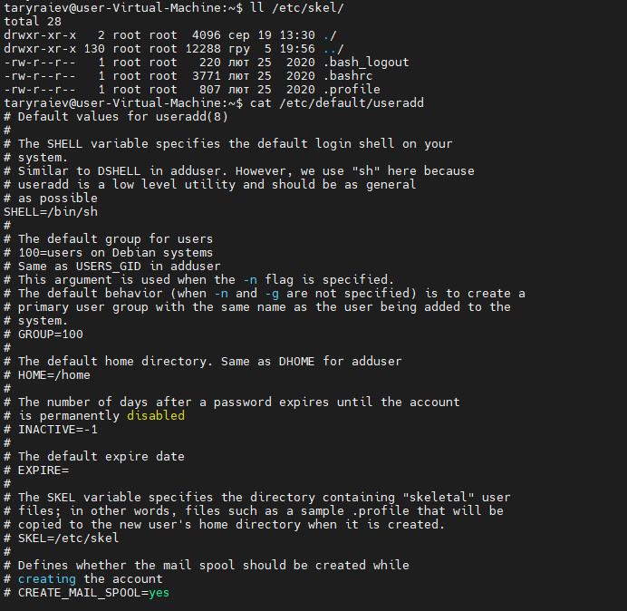

8. How to remove a user from the system (including his mailbox)?

To delete user his home dir and mail we can you command 'userdel -r username'

9. What commands and keys should be used to lock and unlock a user account?

to lock user 'passwd -l username' or 'usermod -L username'

to unlock user 'passwd -u username' or 'usermod -U username'

10. How to remove a user's password and provide him with a password-free login for subsequent password change?

If the user has sudo privileges, enable 'NOPASSWD' option in 'sudo visudo'. After using command 'sudo paswd -d whoami'

* 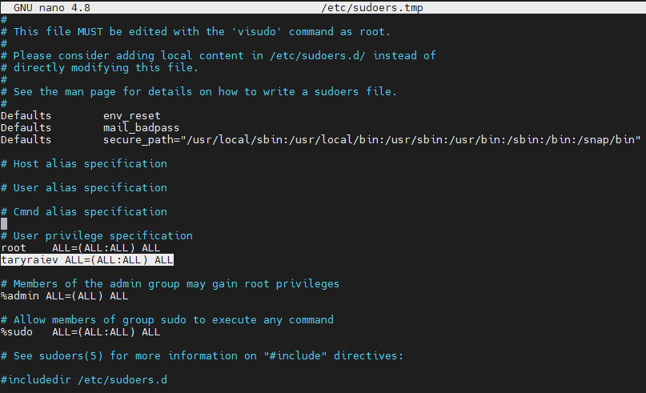

* 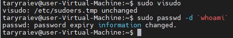

11. Display the extended format of information about the directory, tell about the information columns displayed on the terminal.

Command 'll -h' extend long format with "human" file sizes. In description(inode) of a file - type,  rights, owner information, file size, timestamp of creation.

* 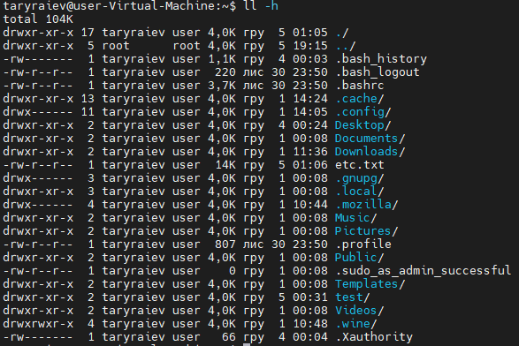

12. What access rights exist and for whom (i. e., describe the main roles)? Briefly describe the acronym for access rights.

After the first character of file type '-, d, b, c, l, p, s', we can define access rights representation 'rwxrwxrwx'. First triplet its access rights for user(owner, u) next triplet is group owns(g), last is 'others' access rights(o). We can change rights for files or directories by the commands like 'chmod g-rw myfile.txt', 'chmod o=rw myfile.txt'. Also, wу can change mod by numeric commands 'chmod 741 myfile.txt' where r=4, w=2, x=1, and we can sum numbers to get needed rights for each access group (user, group, others).

13. What is the sequence of defining the relationship between the file and the user?

The granting of file permissions also depends on the permissions of the directory in which the file is located. For example, even if the file permissions are set as -rwxrwxrwx, other users cannot access the file unless they have read and executed permissions on the directory where the file is located. For example, if the User wanted to restrict access to all of his files, he could set the permissions on his / home / user directory to -rwx ------. Thus, no other user will have access to his directories and to all files and directories within him. The User will no longer need to worry about separate permissions for each of his files.

14. What commands are used to change the owner of a file (directory), as well as the mode of access to the file? Give examples, demonstrate on the terminal.

'chown' command for changing owner of file or dir.

* 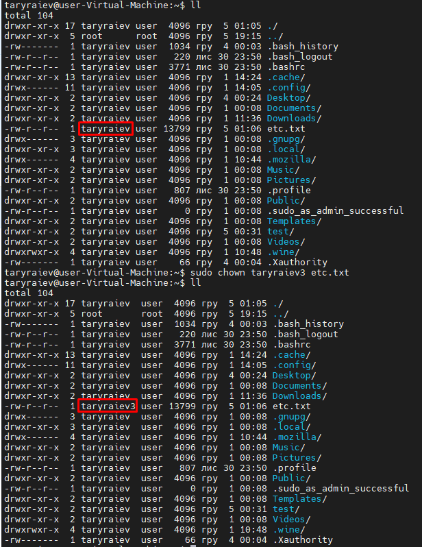

15. What is an example of octal representation of access rights? Describe the umask command.

The notation consists of at least three digits. Each of the three rightmost digits represents a different component of the permissions: owner, group, and others. Where r=4, w=2, x=1 (comparison with symbol notation). Also have or no have Sticky bit value 0 or 1. Example 0777.

16. Give definitions of sticky bits and mechanism of identifier substitution. Give an example of files and directories with these attributes.

The sticky bit is a permission bit that is set on a file or a directory that lets only the owner of the file/directory or the root user delete or rename the file. No other user is given privileges to delete the file created by some other user.

* 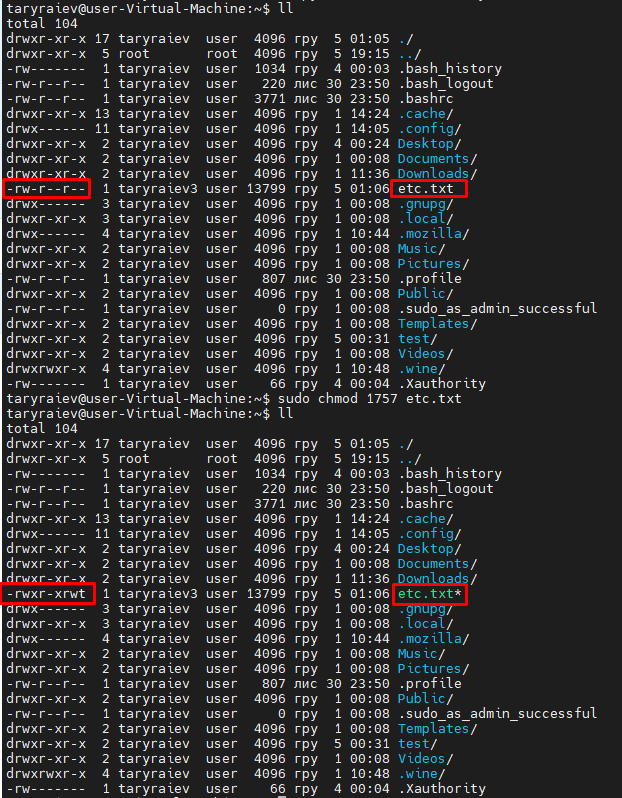

17. What file attributes should be present in the command script?

File attributes that enable further customization of allowable file operations. Example of command '# chattr +i /path/file'. Available attributes are a: append-only c: compressed d: no dump e: extent format i: immutable j: data journalling s: secure deletion t: no tail-merging u: undeletable A: no time updates C: no copy on write D: synchronous directory updates S: synchronous updates T: top of the directory hierarchy