# Task 5.3

*Part 1. 

1. How many states could has a process in Linux?

-- Running (R)
-- Stopped (T)
-- Zombie (Z)
-- Interruptible Sleep (S)
-- Uninterruptible Sleep (D)

2. Examine the pstree command. Make output (highlight) the chain (ancestors) of the current process.

* 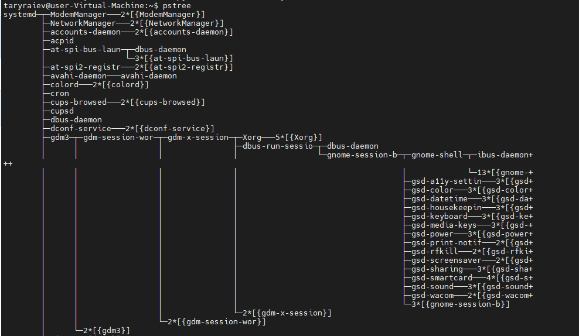

* 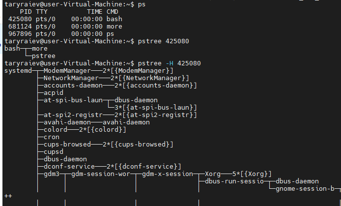

* 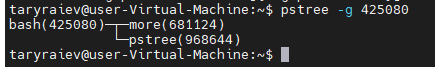

3. What is a proc file system?

The proc filesystem (procfs) is a special filesystem in Unix-like operating systems that presents information about processes and other system information in a hierarchical file-like structure, providing a more convenient and standardized method for dynamically accessing process data held in the kernel than traditional tracing methods or direct access to kernel memory.

4. Print information about the processor (its type, supported technologies, etc.).

4.1 use lscpu

* 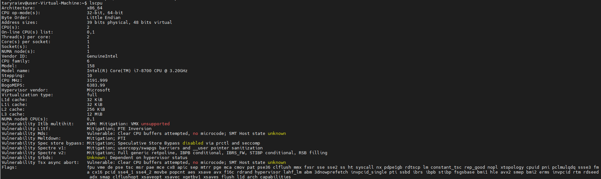

4.2 use cat /proc/cpuinfo

* 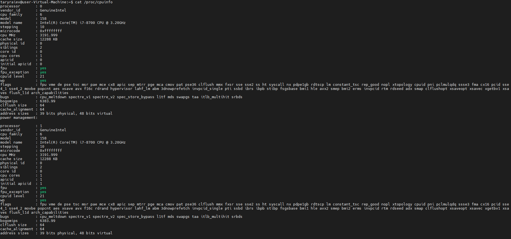

5. Use the ps command to get information about the process. The information should be as follows: the owner of the process, the arguments with which the process was launched for execution, the group owner of this process, etc. 

-- ps - default proccess info
-- ps aux - short summary of the active processes
-- ps -eF" - all proccess full and lonf info
-- ps -efH - all processes with tree mode, show child processes
-- ps -efL - view the list of processes with threads
-- ps -fu username - list of processes for a specific user
-- ps fax show hierarchical relationships between parent and child processes

* 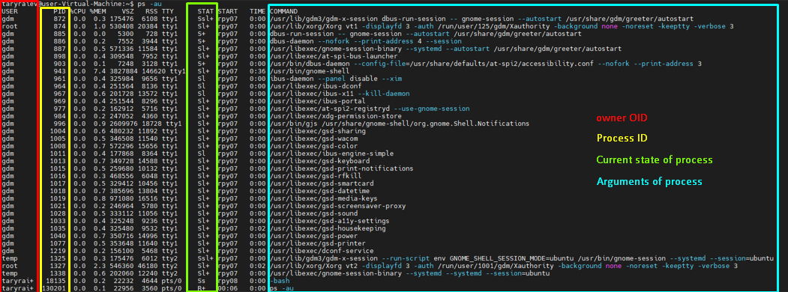

6. How to define kernel processes and user processes?

-- A user process always runs in user mode and uses user space only.

-- A kernel process always runs in kernel mode and uses kernel space only.

7. Print the list of processes to the terminal. Briefly describe the statuses of the processes. What condition are they in, or can they be arriving in?

* 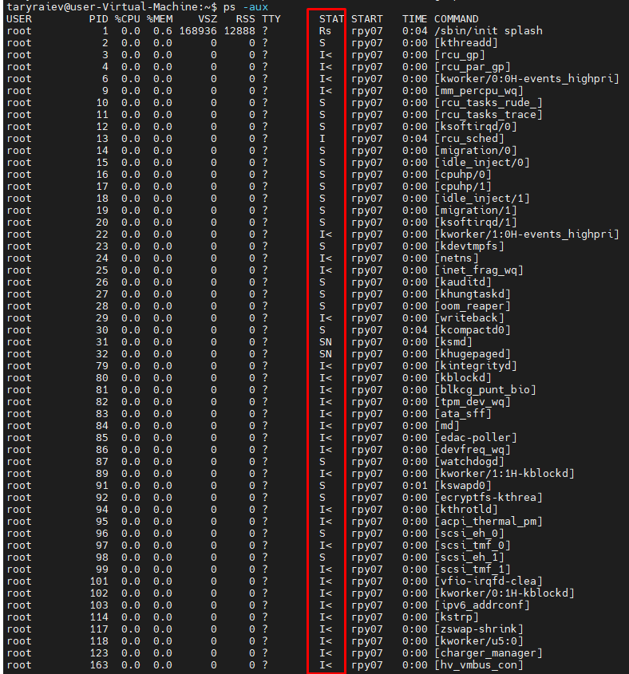

-- D Uninterruptible sleep (usually IO)

-- R Running or runnable (on run queue)

-- S Interruptible sleep (waiting for an event to complete)

-- T Stopped, either by a job control signal or because it is being traced.

-- W paging (not valid since the 2.6.xx kernel)

-- X dead (should never be seen)

-- Z Defunct ("zombie") process, terminated but not reaped by its parent.

-- < high-priority (not nice to other users)

-- N low-priority (nice to other users)

-- L has pages locked into memory (for real-time and custom IO)

-- s is a session leader

-- l is multi-threaded (using CLONE_THREAD, like NPTL pthreads do)

8. Display only the processes of a specific user. 

* 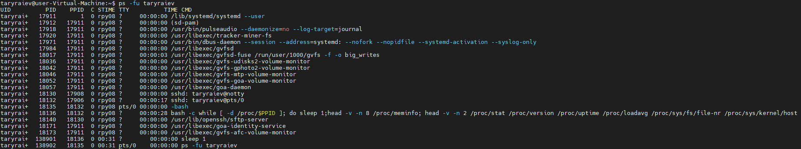

9. What utilities can be used to analyze existing running tasks (by analyzing the help for the ps command)?

-- man ps 

* 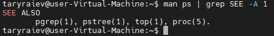

10. What information does top command display?

-- The Top command displays a summary of the systems hardware load, how many processes are running in the system and in what state they are, and also allows you to filter them in the real-time.

* 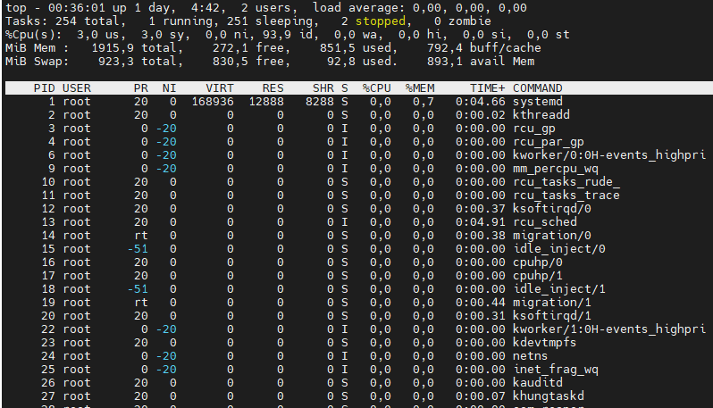

11. Display the processes of the specific user using the top command.

* 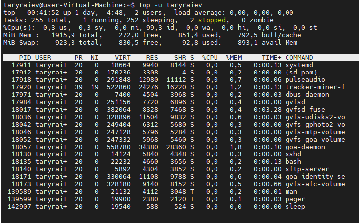

12. What interactive commands can be used to control the top command? Give a couple of examples.

-- 'top' press 'h'

* 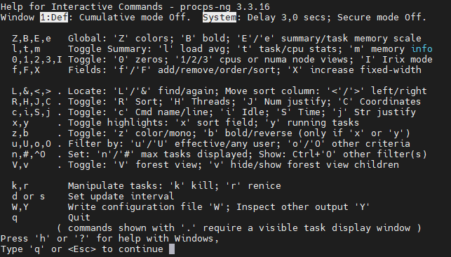

-- Press 'c' option in running top command will display the absolute path of the running process.

* 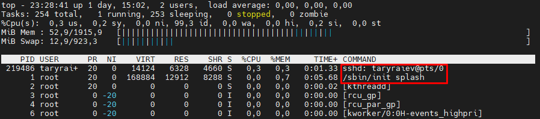

-- Press 'k' to kill any process

* 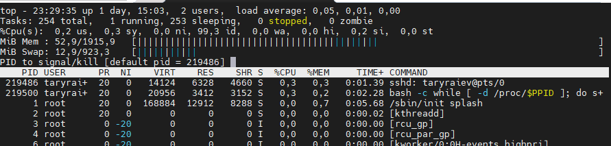

-- Press 'u' to sort process by username

* 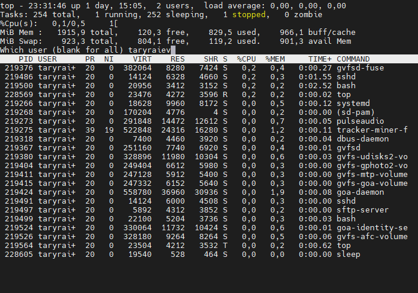

13. Sort the contents of the processes window using various parameters (for example, the amount of processor time taken up, etc.)

-- Press 'shift'+'F' to opem fields management window, and press 's' on column name after press q for example sort by name:

* 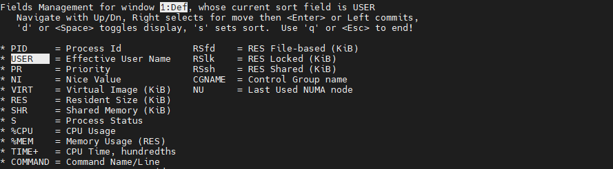

* 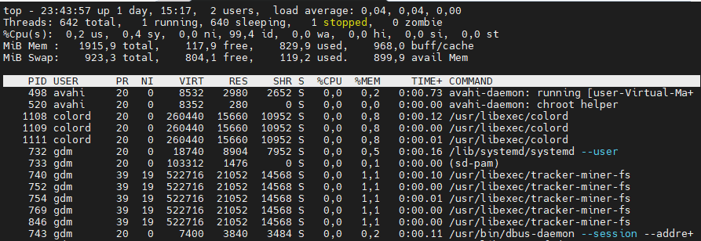

-- and processor time

* 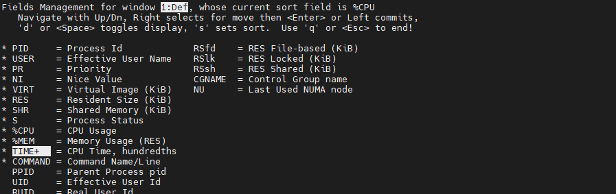

* 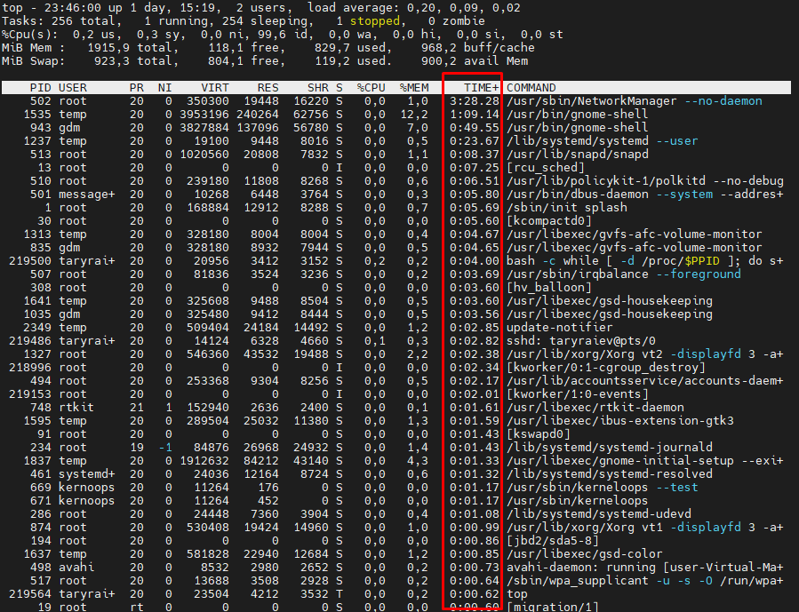

14. Concept of priority, what commands are used to set priority?

-- The linux process priority means how much more CPU time will be devoted to this process compared to others. So we can very finely tune which program will run faster and which will be slower. The priority value can range from '19' (minimum priority) to '-20' - the maximum priority of the linux process. We can reduce the priority with the rights of a regular user, but to increase it, you need superuser rights.

-- To set priority we can use command 'nice'. Example 'nice -n 10 apt-get upgrade'

15. Can I change the priority of a process using the top command? If so, how?

-- open 'top' and press 'r'. Give PID value of the process to change the process value. Set renice value (from -20 to +19)

16. Examine the kill command. How to send with the kill commandprocess control signal? Give an example of commonly used signals.

-- Basic template of 'kill' command it's 'kill by PID'
'kill 5612' - send SIGTERM to process ID 5612
'kill -KILL 5613' or 'kill -9 5613' - send SIGKILL to process ID 5613
'kill -9 2222 4556 4455' - kill multiple processes

17. Commands jobs, fg, bg, nohup. What are they for? Use the sleep, yes command to demonstrate the process control mechanism with fg, bg.

'jobs -l' - show processes number and background ID of process, state of process
'fg'      - back process from the background
'bg'      - change state of process to backgound
'nohup'   - start a hang-protected command with output to non-tty (ignores loss of SIGHUP communications).

* 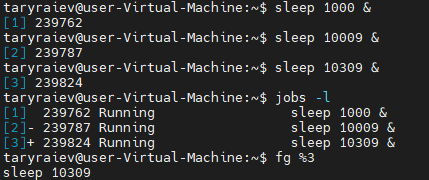

* 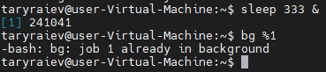

*Part 2. 

1. Check the implementability of the most frequently used OPENSSH commands in the MS Windows operating system. (Description of the expected result of the commands + screenshots: command – result should be presented)

-- Open ssh by Administrator and check install open ssh client or type ssh:

* 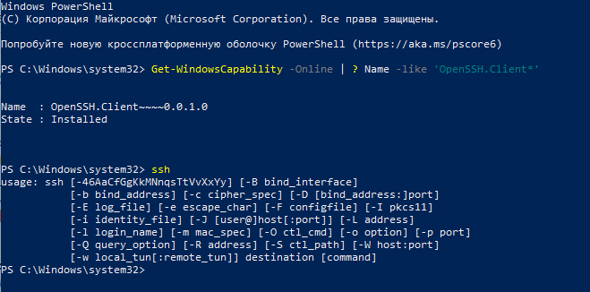

-- If SSH not instaled we can use this comand from Administrator in powershell 'dism /Online /Add-Capability /CapabilityName:OpenSSH.Client~~~~0.0.1.0' 

-- to connect by default port 'ssh username@host' for example 'ssh taryraiev@192.168.88.108'

* 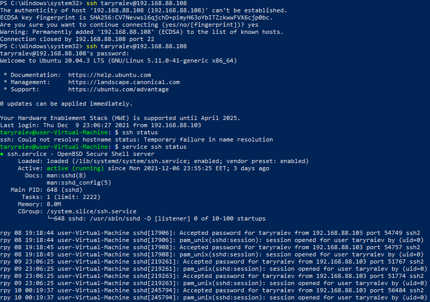

-- for example generate ssh key by 'ssh-keygen' for exemple from windows comandline

* 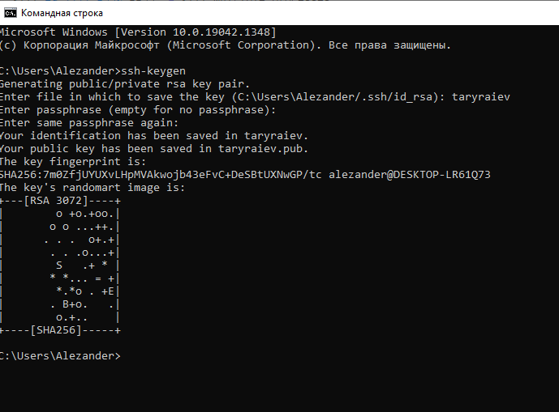

2. Implement basic SSH settings to increase the security of the client-server connection (at least 

-- Change default port from 22 in 'nano /etc/ssh/sshd_config' and retart ssh 'service sshd restart'

-- Disable Empty Passwords, open /etc/ssh/sshd_config file and update the line: 'PermitEmptyPasswords no'

-- Disable Root Logins. To disable Root Logins, we need to edit the SSHD configuration file. Open /etc/ssh/sshd_config file. Change line #PermitRootLogin to PermitRootLogin no

-- Connet only by ssh 2 protocol 'nano /etc/ssh/sshd_config' line #Protocol 2, 1 change to Protocol 2

-- Open port to soecial clients ip`s. 'iptables -A INPUT -p tcp -s specIP --dport 22 -j ACCEPT' open ony for specIP client.

-- connect to the server by ssh key and set file permissions on the server chmod '700 ~/.ssh chmod' and '600 ~/.ssh/authorized_keys'

3. List the options for choosing keys for encryption in SSH. Implement 3 of them.

-- encryption algoritms: rsa, dsa, ecdsa, ecdsa-sk, ed25519, ed25519-sk.

* 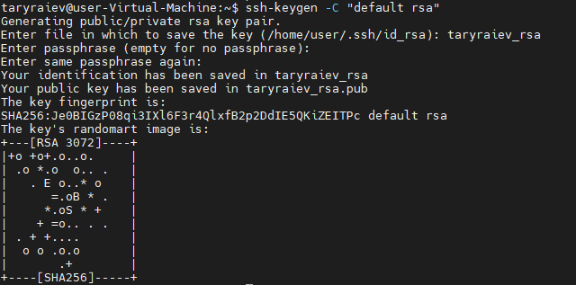

* 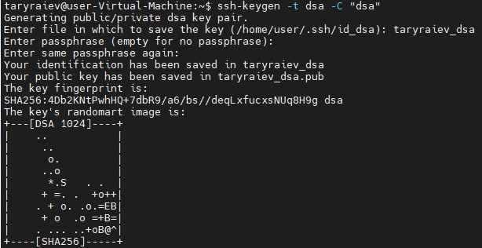

* 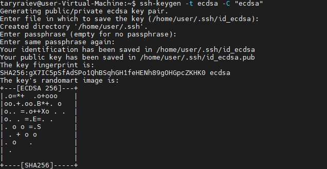

4. Implement port forwarding for the SSH client from the host machine to the guest Linux virtual machine behind NAT.

* 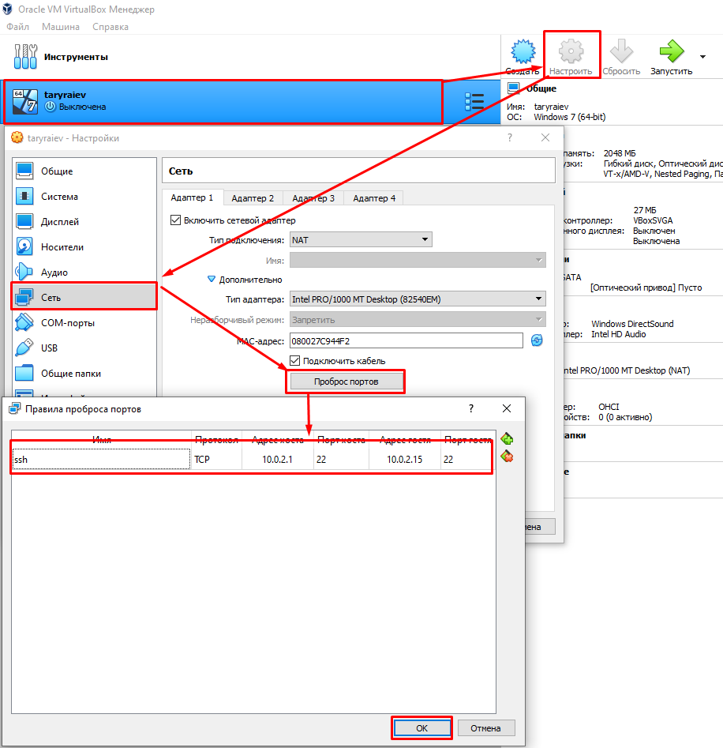

5*. Intercept (capture) traffic (tcpdump, wireshark) while authorizing the remote client on the server using ssh, telnet, rlogin. Analyze the result. 

-- to save tcpdump in file trafic from 22 port

* 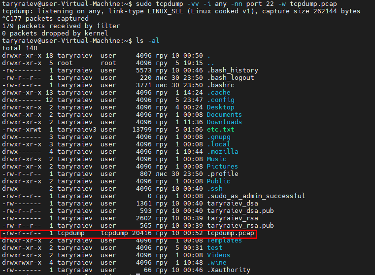

for example list 5 line from tcpdump we see data exchange between 'user-virtual-Machine' to client '192.168.88.103' by 22 port

* 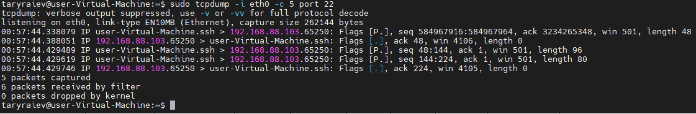