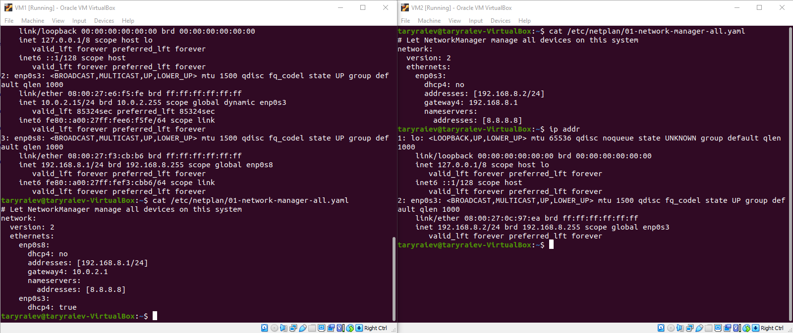

# Task 6.1

** 1.Create virtual machines connection according to figure 1:

Internet
|
Host - VM1 – VM2

* 

** 2.VM2 has one interface (internal), VM1 has 2 interfaces (NAT and internal). Configure  all networkinterfaces in order to make VM2 has an access to the Internet (iptables, forward, masquerade).   

** Configure netplan VM1 and VM2.

* 

** Configure access to the Internet to VM2 (iptables, forward, masquerade).

* 

** 3.Check the route from VM2 to Host. 

** install traceroute and test 

* 

** 4.Check the access to the Internet, (just ping, for example, 8.8.8.8). 

* 

** 5.Determine, which  resource has an IP address 8.8.8.8.

* 

** 6.Determine, which  IP address belongs to resource epam.com. 

* 

** 7.Determine the default gateway for your HOST and display routing table. 

* 

** 8.Trace the route to google.com. 

* 

