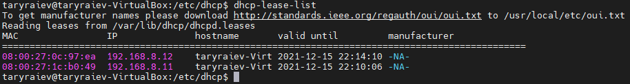

# Task 6.2

** 1.Use  already created internal-network for three VMs (VM1-  VM3)  .  VM1 has NAT and internal, VM2, VM3 – internal only interfaces.

* 

** 2.Install and configure DHCP server on VM1. (3 ways: using VBoxManage, DNSMASQ and ISC-DHSPSERVER).  You should use at least 2 of them.

** ISC-DHSPSERVER

* 

* 

** DNSMASQ

* 

** 3.Check VM2 and VM3  for obtaining  network addresses from DHCP server.  

** ISC-DHSPSERVER
* 

** DNSMASQ

* 

** 4.Using existed network for three VMs ( from p.1) install and configure DNS server on VM1. (You can use DNSMASQ, BIND9 or something else). 

* 

** 5.Check VM2 and VM3  for gaining access to DNS server ( naming services). 

* 

* 

